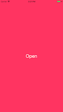
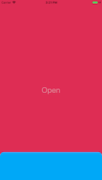
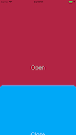
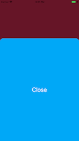

# Backdrop Segue 

A backdrop segue providing custom `UIStoryboardSegue`'s to present and dismiss a `UIViewController` using the backdrop UI pattern.






## Usage

### Segue

In your storyboard, create a segue as usual between two view controllers. Select the segue and in the Attributes Inspector set the Class to `BackdropPresentingSegue` and Kind to `custom`.

### Unwind Segue

Add the following method to your first view controller, in order to setup an unwind segue:

```swift
@IBAction func unwindSegue(segue: UIStoryboardSegue) { }
```

Then, in your storyboard, create an unwind segue to your view controller's "Exit".  Select the segue and in the Attributes Inspector set the Class to `BackdropDismissSegue ` and Kind to `custom`.

## License

Backdrop Segue is released under the [MIT License](LICENSE.md).
